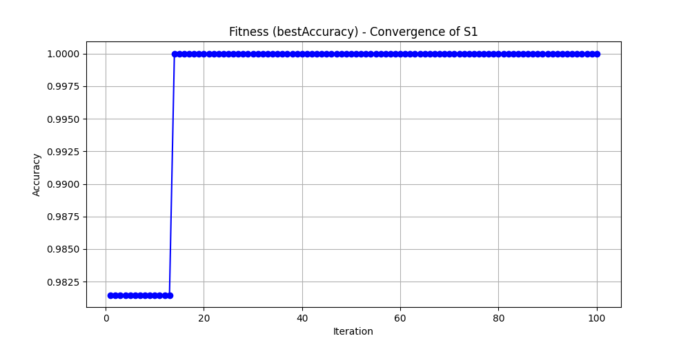

# 📌 Parameter Optimization of SVM

## 🔍 Objective
To optimize the parameters of the `NuSVC` (Support Vector Machine for classification) algorithm using different kernel functions and values of `nu`, across multiple randomized data splits. The goal is to identify the best performing configuration and analyze the convergence behavior.

---

## 📊 Dataset

- **Dataset Name**: Wine Dataset (UCI Machine Learning Repository)
- **Total Samples**: 178
- **Features**: 13 numeric features
- **Classes**: 3 wine cultivars (multi-class classification)

---

## ⚙️ Optimization Details

- **Model Used**: `NuSVC` from `sklearn.svm`
- **Hyperparameters Tuned**:
  - `kernel`: `linear`, `poly`, `rbf`, `sigmoid`
  - `nu`: Random float in the range [0.01, 0.99]
- **Strategy**:
  - 10 different random 70/30 train-test splits (labeled S1 to S10)
  - 100 random parameter trials per sample
- **Evaluation Metric**: Accuracy

---

## 📁 Files Included

| File Name                         | Description                                         |
|----------------------------------|-----------------------------------------------------|
| `parameter_optimization.ipynb`   | Main Colab notebook used for the experiment         |
| `optimized_svm_results.csv`      | Table showing best accuracy & parameters per sample |
| `convergence_plot_best_svm.png`  | Convergence graph for the best-performing sample    |
| `README.md`                      | Project overview and explanation                    |

---

## 🧪 Results

### ✅ Table 1: Best Accuracy and Parameters (Top 10 Samples)

| Sample | Best Accuracy | Kernel | Nu |
|--------|----------------|--------|----|
| S1     | *e.g. 0.96*    | rbf    | 0.27 |
| S2     | *e.g. 0.94*    | poly   | 0.31 |
| S3     | ...            | ...    | ... |
| ...    | ...            | ...    | ... |

📁 *Full results in `optimized_svm_results.csv`*

---

### 📉 Convergence Plot

This graph shows how the accuracy improved over 100 iterations in the best-performing sample.

---

## ✅ Conclusion

- **Best accuracy** achieved using:  
  - `kernel = '...'`, `nu = ...`
- **Preprocessing** with `StandardScaler` improved model consistency.
- The **convergence graph** visualizes optimization progress clearly.
- SVM performance varies significantly with random splits and parameter combinations.

---

## 👨‍💻 Author
**Name**: Jeevetesh Bhanot  
**Course**: Machine Learning — Parameter Optimization Assignment  
**Instructor**: _(as per course)_

